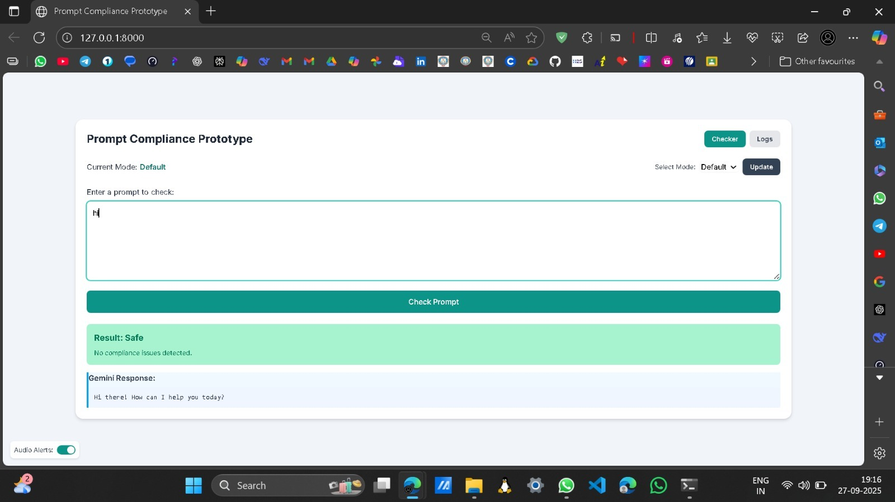
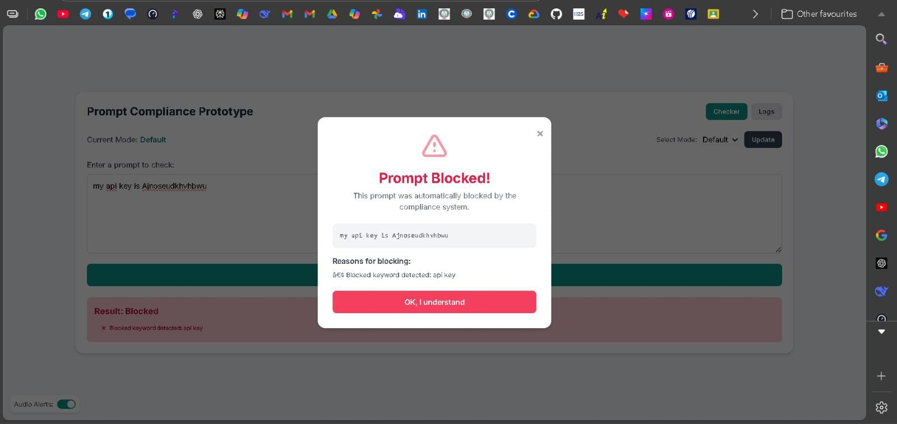
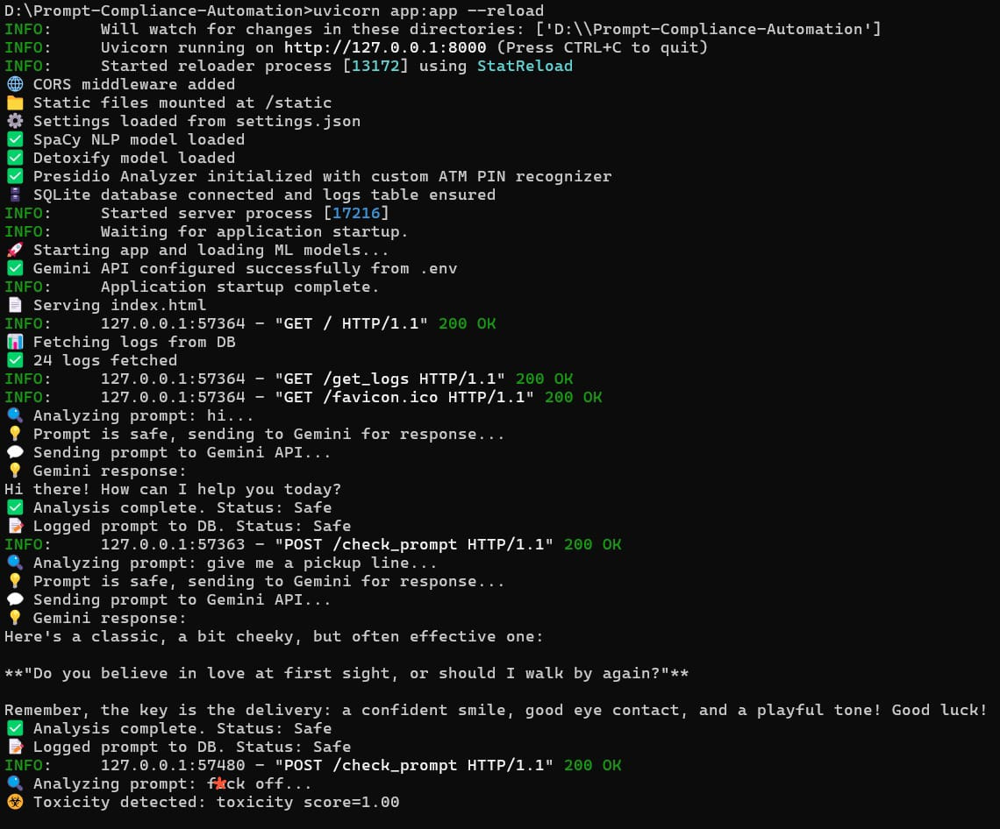
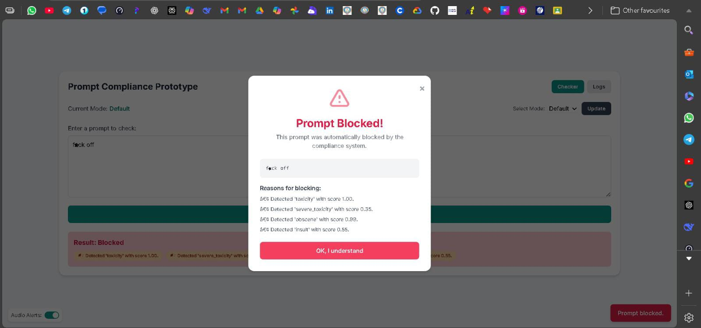
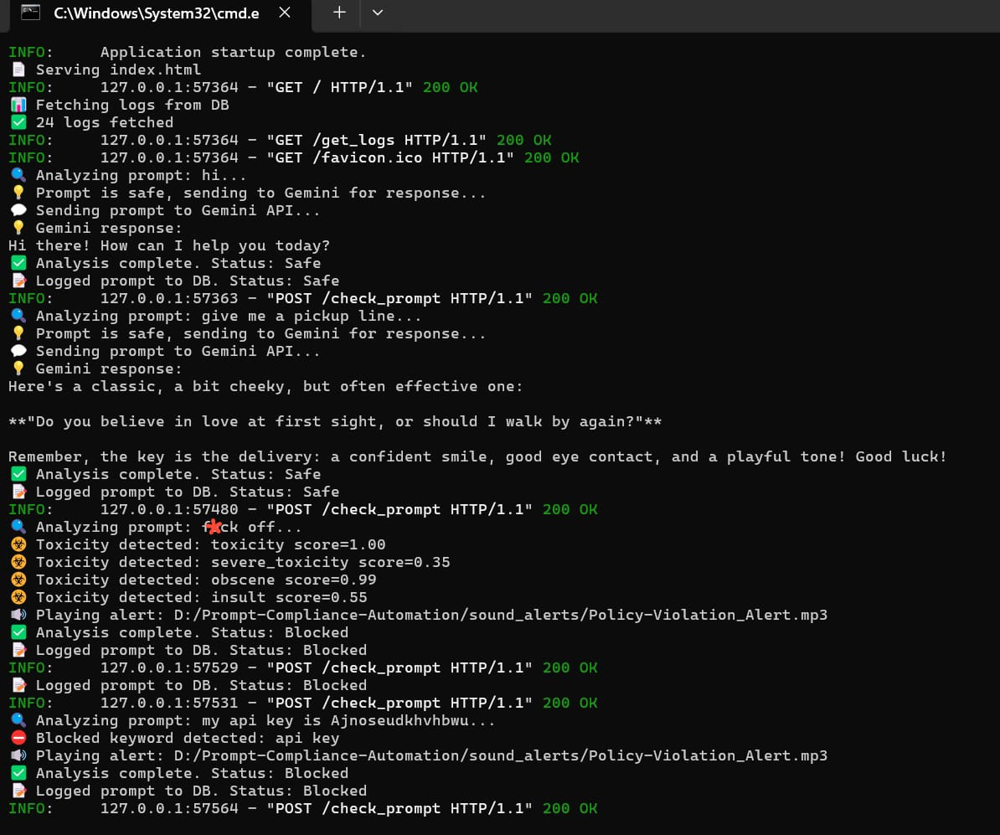
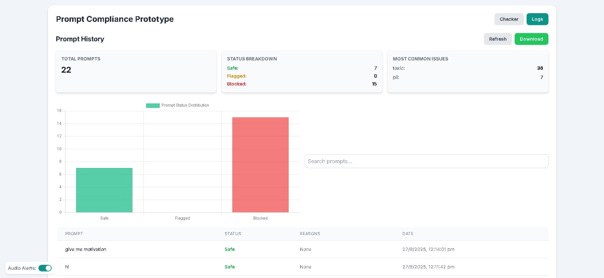

# Prompt Compliance Automation

 


## 📌 Overview

Prompt Compliance Automation is a middleware solution designed to help users securely leverage Large Language Models (LLMs) while protecting sensitive data. It analyzes and moderates prompts to detect toxic content, sensitive keywords, and PII.

## 🏗️ Architecture

```text
Browser / UI
     │   HTTP
     ▼
FastAPI app
     │
     └──▶ External services — Google Gemini
```

## 🧰 Tech Stack

- **Language:** Python
- **Backend:** FastAPI
- **Integrations:** Google Gemini

## 🚀 Getting Started

### Prerequisites

- Python 3.10+

### 1. Clone

```bash
git clone https://github.com/SabarishR08/Prompt-Compliance-Automation.git
cd Prompt-Compliance-Automation
```

### 2. Install dependencies

```bash
python -m venv .venv
source .venv/bin/activate   # Windows: .venv\Scripts\activate
pip install -r requirements.txt
```

### 3. Configure environment

```bash
cp .env.example .env   # then fill in values
```

Environment variables used: `GEMINI_API_KEY`, `ALLOWED_ORIGINS`, `TRUSTED_HOSTS`.

External services involved: Google Gemini.

### 4. Run

```bash
python app.py
```


---

 


## 📌 Overview

Prompt Compliance Automation is a middleware solution designed to help users securely leverage Large Language Models (LLMs) while protecting sensitive data. It analyzes and moderates prompts to detect toxic content, sensitive keywords, and PII.

## 🏗️ Architecture

```text
Browser / UI
     │   HTTP
     ▼
FastAPI app
     │
     └──▶ External services — Google Gemini
```

## 🧰 Tech Stack

- **Language:** Python
- **Backend:** FastAPI
- **Integrations:** Google Gemini

## 🚀 Getting Started

### Prerequisites

- Python 3.10+

### 1. Clone

```bash
git clone https://github.com/SabarishR08/Prompt-Compliance-Automation.git
cd Prompt-Compliance-Automation
```

### 2. Install dependencies

```bash
python -m venv .venv
source .venv/bin/activate   # Windows: .venv\Scripts\activate
pip install -r requirements.txt
```

### 3. Configure environment

```bash
cp .env.example .env   # then fill in values
```

Environment variables used: `GEMINI_API_KEY`, `ALLOWED_ORIGINS`, `TRUSTED_HOSTS`.

External services involved: Google Gemini.

### 4. Run

```bash
python app.py
```


---

Prompt Compliance Automation is a FastAPI-based middleware service that screens LLM prompts before they reach a model endpoint. It detects sensitive keywords, PII, and toxic content, then classifies each prompt as Safe, Flagged, or Blocked.

## Overview

The service sits between users and LLMs, applies policy checks, logs every decision, and exposes a lightweight dashboard for review. It is designed for local use, demo environments, and internal compliance workflows.

## Key Features

- Real-time prompt analysis and classification
- Keyword policy checks for flagged and blocked terms
- PII detection and redaction with Presidio
- Toxicity scoring with configurable Detoxify thresholds
- SQLite audit logging with indexed lookups
- Web dashboard for prompt review and log inspection
- Security headers, trusted-host checks, and response compression
- Optional admin protection for sensitive endpoints

## How It Works

1. A user submits a prompt to the FastAPI endpoint.
2. The service runs keyword, PII, and toxicity checks.
3. The prompt is classified and redacted when needed.
4. The result is written to SQLite for auditability.
5. Safe prompts can be forwarded to Gemini for a response.

## Screenshots

### Dashboard

<p align="center">
  
</p>

### Safe Prompt Response

<p align="center">
  
</p>

### PII Detection

<p align="center">
  
</p>

<p align="center">
  
</p>

### Toxicity Detection

<p align="center">
  
</p>

<p align="center">
  
</p>

### Audit Logs

<p align="center">
  
</p>

## Project Layout

- app.py: FastAPI service and moderation pipeline
- index.html: Web dashboard
- clear_db.py: Utility to clear SQLite logs
- settings.json: Policy and threshold configuration
- requirements.txt: Pinned project dependencies
- .env.example: Environment variable template
- images/: Screenshots and assets
- tests/: Security regression tests

## Requirements

- Python 3.10 or newer
- A virtual environment is recommended
- spaCy model: en_core_web_sm

## Setup

### 1) Create and activate a virtual environment

```bash
python -m venv .venv
.venv\Scripts\activate
```

### 2) Install dependencies

```bash
pip install -r requirements.txt
python -m spacy download en_core_web_sm
```

### 3) Configure environment variables

Create a .env file in the project root:

```env
GEMINI_API_KEY=your_google_api_key
ALLOWED_ORIGINS=http://127.0.0.1:8000,http://localhost:8000
TRUSTED_HOSTS=127.0.0.1,localhost
ADMIN_API_KEY=optional_admin_key
RATE_LIMIT_WINDOW_SECONDS=60
RATE_LIMIT_MAX_REQUESTS=20
SKIP_HEAVY_SCANS_WHEN_BLOCKED=true
```

## Run

```bash
uvicorn app:app --reload --port 8000
```

Open http://127.0.0.1:8000 in a browser.

## API Endpoints

- POST /check_prompt: Analyze a prompt and return classification details
- GET /get_logs: Retrieve log history, admin protected when ADMIN_API_KEY is set
- GET /get_logs?limit=200&offset=0&status=Blocked: Paginated and filterable logs
- POST /clear_logs: Delete all audit logs, admin protected
- POST /update_mode: Update moderation mode label, admin protected
- GET /get_settings: Return active policy configuration, admin protected
- GET /health: Service health and model availability

## Security Notes

- Do not commit API keys or tokens to repository files
- Keep .env local and excluded from source control
- Restrict CORS origins in ALLOWED_ORIGINS for production
- Rotate any key that has ever been committed

## Testing

```bash
pytest -q tests/test_app_security.py
```

## Contributing

See [CONTRIBUTING.md](CONTRIBUTING.md) for workflow and contribution guidelines.

---

## 📄 License

[MIT](LICENSE) — © 2026 Sabarish R.

---

## 📄 License

[MIT](LICENSE) — © 2026 Sabarish R.
