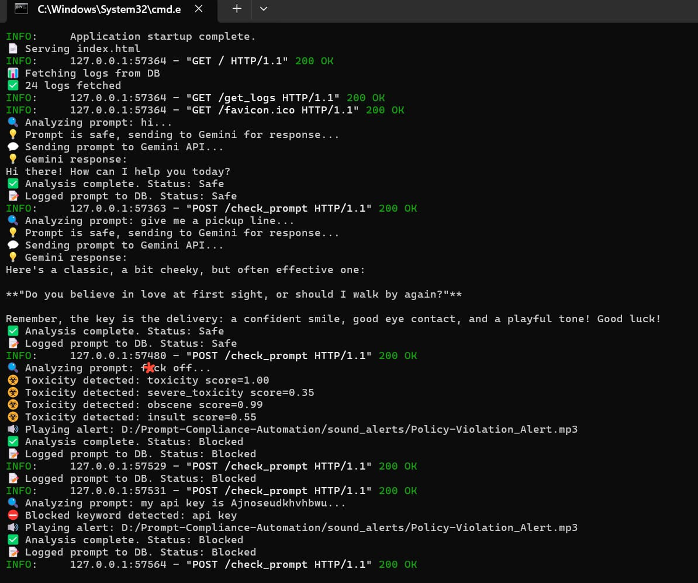

# Prompt Compliance Automation

Prompt Compliance Automation is a middleware solution that helps organizations safely use Large Language Models (LLMs) while protecting sensitive and confidential data.

It analyzes and moderates prompts to detect toxic content, sensitive keywords, and Personally Identifiable Information (PII), ensuring unsafe content is redacted or blocked so users can leverage AI tools without risking data leakage or regulatory non-compliance.

## 📌 Problem Statement

Organizations increasingly rely on LLMs for tasks such as debugging, documentation, and brainstorming. Employees may unknowingly share sensitive data (PII, API keys, source code, internal assets) with external AI tools, creating risks such as:

1. **Data leakage and asset loss**
2. **Regulatory non-compliance** (e.g., GDPR, ISO)

Prompt Compliance Automation acts as a secure gateway that ensures prompts are safe, compliant, and redacted before they reach the LLM.

## 🎯 Goals

| Goal | Description |
| :--- | :--- |
| **Real-time Detection** | Detect blocked/flagged keywords and entities in real time |
| **PII Management** | Identify and redact PII while preserving surrounding context |
| **Toxicity Analysis** | Detect toxic or unsafe content using pre-trained ML models |
| **Configurability** | Provide configurable compliance rules and moderation modes |
| **Audit Trails** | Maintain structured logs of all actions for audit and monitoring |

## 🛠️ Solution Overview

The middleware sits between the user and the external LLM, processing and moderating input based on compliance rules.

### Workflow

1. Prompt → API (FastAPI)  
2. API → Analyzer  
3. Analyzer performs checks (keyword, PII, toxicity)  
4. Prompt is redacted & classified (Safe, Flagged, Blocked)  
5. Action is logged (SQLite)  
6. If Safe → forward to Gemini/local LLM for a response  
7. If Flagged/Blocked → alert or reject the prompt  
8. All activity is visible on the dashboard (HTML/JS)

### ✅ Key Features

- Real-time prompt analysis  
- Keyword filtering (flagged & blocked terms)  
- PII detection & redaction (phone numbers, ATM PINs, credit cards, etc.)  
- Toxicity analysis using Detoxify thresholds  
- Audio alerts for flagged/blocked prompts  
- SQLite database for audit logs  
- Multiple moderation modes: Default / Custom / Hybrid  
- Optional local LLM support to avoid sending confidential data externally

### 📊 Metrics Impact

- Improves detection of toxic and sensitive content  
- Reduces manual moderation effort  
- Ensures PII redaction with traceable, time-stamped logs  
- Centralizes configurable compliance rules across the organization

## 🖥️ Architecture & Tech Stack

| Component | Technology | Role |
| :--- | :--- | :--- |
| Backend API | Python, FastAPI | Middleware API and processing |
| Frontend | HTML, CSS, JavaScript | Dashboard & interactions |
| NLP / ML | spaCy, Presidio, Detoxify | PII detection & content moderation |
| Database | SQLite | Audit and compliance logs |

## ⚙️ Installation & Setup

### 1) Clone the repository

```bash
git clone https://github.com/SabarishR08/Prompt-Compliance-Automation.git
cd Prompt-Compliance-Automation
```

### 2) Create virtual environment & install dependencies

```bash
# Create and activate environment
python -m venv venv
source venv/bin/activate   # On Linux / macOS
venv\Scripts\activate      # On Windows

# Install required packages
pip install -r requirements.txt
```

### 3) Setup environment variables (.env)

Create a `.env` file in the project root:

```env
GEMINI_API_KEY=your_google_api_key
ALERT_PII_PATH=./sound_alerts/PII_Alert.mp3
ALERT_POLICY_PATH=./sound_alerts/Policy-Violation_Alert.mp3
```

### 4) Run the application

```bash
uvicorn app:app --reload --port 8000
```

Open: `http://127.0.0.1:8000`

## 📂 Project Structure

```
Prompt-Compliance-Automation/
│   .env
│   .gitignore
│   app.py                  # Main FastAPI logic
│   clear_db.py             # Script to clear the SQLite DB
│   index.html              # Frontend dashboard
│   logs.db                 # SQLite database
│   README.md
│   requirements.txt
│   settings.json           # Configurable policy rules
├── sound_alerts/
│       PII_Alert.mp3
│       Policy-Violation_Alert.mp3
└── __pycache__/
```

## 🔑 API Endpoints

| Method | Endpoint | Description |
| :--- | :--- | :--- |
| POST | /check_prompt | Analyze prompt, return compliance status and LLM response if safe |
| GET  | /get_logs     | Fetch all stored logs |
| POST | /clear_logs   | Clear logs from DB |
| POST | /update_mode  | Update compliance mode (default/custom/hybrid) |
| GET  | /get_settings | Fetch current policy settings |

## 📊 Sample Workflow

1. User submits a prompt.  
2. API checks blocked keywords, PII entities (Presidio), and toxicity (Detoxify).  
3. Prompt is classified as:
  - ✅ Safe → forwarded to Gemini/local LLM; response logged (images/test_safe_response-received.jpeg)
  - ⚠️ Flagged → redacted / warning raised
  - ⛔ Blocked → rejected with alert sound (images/test_pii_blocked.jpeg)
4. Logs are stored in SQLite for audits (images/Log_Dashboard.jpeg)

> Future enhancement: suggest safe rephrased prompts using a local middleware LLM for blocked/unsafe inputs.

## 📚 Real-World Relevance

### Use Case

Employees sometimes paste source code, API keys, or internal data into external AI tools, risking data leakage and regulatory violations. The middleware inspects and protects prompts before forwarding them, reducing the risk of data breaches.

### Industry Examples

- Samsung data leak (2023) — engineers accidentally leaked source code into ChatGPT  
- Companies (Apple, Amazon) restricting internal use of generative AI  
- Case study: a global firm found ~22% of developers pasted secrets into external AI tools — potential multi-million-dollar exposure

## 🔮 Future Scope

- Multi-language & enterprise compliance support  
- Dockerized microservice deployment  
- Role-Based Access Control (RBAC)  
- MLOps monitoring dashboards  
- Cloud scaling (AWS / GCP)  
- Middleware LLM for safe rephrasing  
- Expanded local LLM integration for private responses

## ✍️ Author & Contact

- **Author:** Sabarish R  
- **Email:** sabarish.edu2024@gmail.com  
- **LinkedIn:** https://www.linkedin.com/in/sabarishr08

## 📜 License

This project is licensed under the MIT License.
| POST | /update\_mode | Update compliance mode (default/custom/hybrid). |
| GET | /get\_settings | Fetch current policy settings. |

## **📊 Sample Workflow**

1. **User submits a prompt.**
   <p></p>
   
   <p></p>

2. API checks: Blocked keywords, PII entities (via **Presidio**), and Toxicity scores (via **Detoxify**).  
3. Prompt is classified as:  
   * ✅ **Safe** → Forward to Gemini or local LLM, log response.
     <p></p>
     
     <p></p>
   * ⚠️ **Flagged** → Redacted / Warning raised.  
   * ⛔ **Blocked** → Rejected with alert sound.
     <p>PII detected -> Prompt blocked</p>
     
     <p></p>
  

   
     <p>Backend Process</p>
     
     <p></p>


 
     <p>Toxicity detected -> Prompt blocked</p>
     
     <p></p>
  

   
     <p>Backend Process</p>
     
     <p></p>
4. Logs stored in **SQLite** for audits.
   
     <p>Backend Process</p>
     
     <p></p>


**Future Enhancement:** Blocked/unsafe prompts can be suggested a safe rephrased prompt using a trained local middleware LLM before sending to external LLM servers (e.g., OpenAI).

## **📚 Real-World Relevance**

### **Use Case Scenario**

In organizations, employees often use AI tools/LLMs to debug errors or generate code. They may inadvertently paste entire source code, API keys, or internal data into the AI tool.

* **Problem:** Data leakage, asset loss, regulatory violations.  
* **Solution:** Our prototype acts as a middleware service. It analyzes prompts before forwarding them. Unsafe or confidential content is either blocked, redacted, or flagged. Employees can safely continue using LLMs without risking data breaches.

### **Industry Impact**

* **Samsung Data Leak (2023):** Engineers leaked source code into ChatGPT.  
* **Apple & Amazon Restrictions:** Limited employee usage of generative AI tools.  
* **Case Study:** A global IT company with 5,000+ developers found \~22% of employees pasted source code or API keys into external AI tools. Potential exposure of millions of lines of code could result in **$4.2M estimated losses**.

Our system could prevent such risks with proactive compliance filtering.

## **🔮 Future Scope**

* Multi-language & enterprise compliance support.  
* Dockerized microservice deployment.  
* Role-Based Access Control (RBAC).  
* MLOps monitoring dashboards.  
* Cloud scaling with AWS / GCP.  
* Middleware LLM for safe rephrasing: Suggest alternate safe prompts for blocked/unsafe inputs.  
* Expand local LLM integration for response generation without exposing confidential data.

## **✍️ Author & Contact**

This project was developed by a security operations enthusiast.

* **Author:** Sabarish R.  
* **Email:** sabarish.edu2024@gmail.com
* **LinkedIn:** [https://www.linkedin.com/in/sabarishr08](https://www.linkedin.com/in/sabarishr08)
